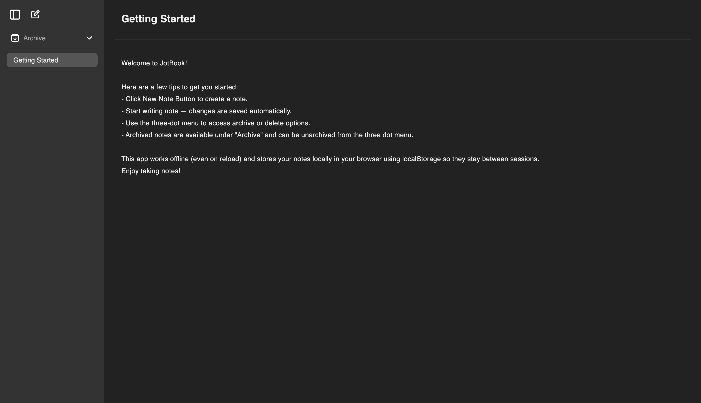

# JotBook

https://jot-book.vercel.app



A beautifully simple note-taking progressive web app for desktop built with React and TypeScript that uses local storage and works offline.

## Features

- 📝 Clean and minimalist note-taking interface
- 💾 Automatic saving with local storage persistence
- 📱 PWA support for offline access and installation
- 🗑️ Archive/unarchive functionality
- 🌟 Clean, modern UI

## Getting Started

### Prerequisites

- Node.js 16.0 or higher
- npm or pnpm

### Installation

1. Clone the repository
```bash
git clone https://github.com/GauravVKulkarni/JotBook.git
cd JotBook
```

2. Install dependencies
```bash
npm install
# or
pnpm install
```

3. Start the development server
```bash
npm run dev
# or
pnpm dev
```

### Building for Production

```bash
npm run build
# or
pnpm build
```

## Technology Stack

- ⚛️ React 18
- 📘 TypeScript
- ⚡ Vite
- 🌐 PWA (Progressive Web App)
- 📦 Local Storage
- 🎨 CSS Modules

## Features in Detail

### Note Management
- Create unlimited notes
- Auto-save functionality
- Smart empty note handling
- Note archival system

### User Interface
- Clean, minimalist design
- Intuitive navigation
- Smooth transitions

### PWA Features
- Offline capability
- Install as desktop app
- Quick loading
- Auto-updates
- Cache management

## Contributing

Contributions are welcome! Please feel free to submit a Pull Request.

1. Fork the project
2. Create your feature branch (`git checkout -b feature/AmazingFeature`)
3. Commit your changes (`git commit -m 'Add some AmazingFeature'`)
4. Push to the branch (`git push origin feature/AmazingFeature`)
5. Open a Pull Request

## License

This project is licensed under the MIT License - see the [LICENSE](LICENSE) file for details.